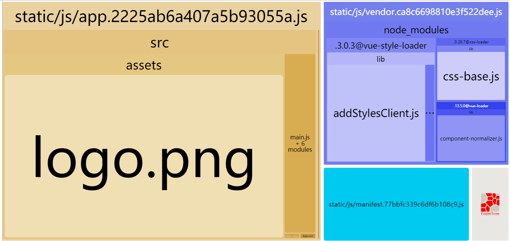

# DllElementTest

## 需求
将`element-ui`预打包成dll后引用
1. 优化项目打包的时间和项目体积
2. UI组件能够正常使用

## 运行说明:

> 测试代码在 `HelloWorld.vue` 文件下

1. 运行 `npm run dll` 可以看到`element-ui`及其各个组件已经被打包到`vendor.dll`中

2. 运行 `npm run build --report` 可以看到在编译生成的代码中已经没有了`ElementUI`的依赖, 符合预期需求(如下图)

3. 运行`npm run dev`发现鼠标移动到按钮上的时候没有弹出`ToolTip` Bug重现.

